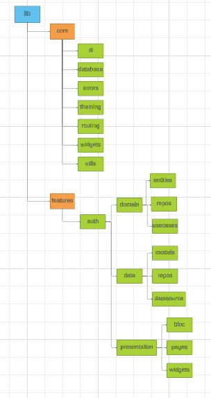
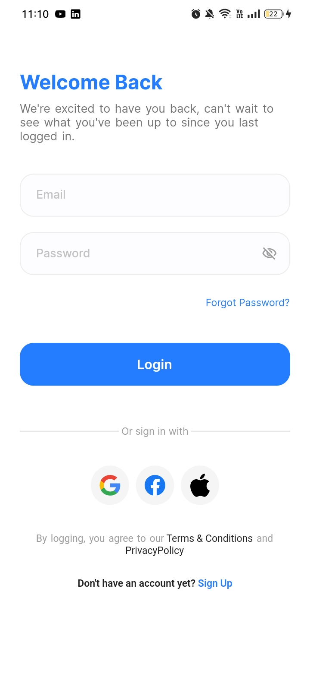
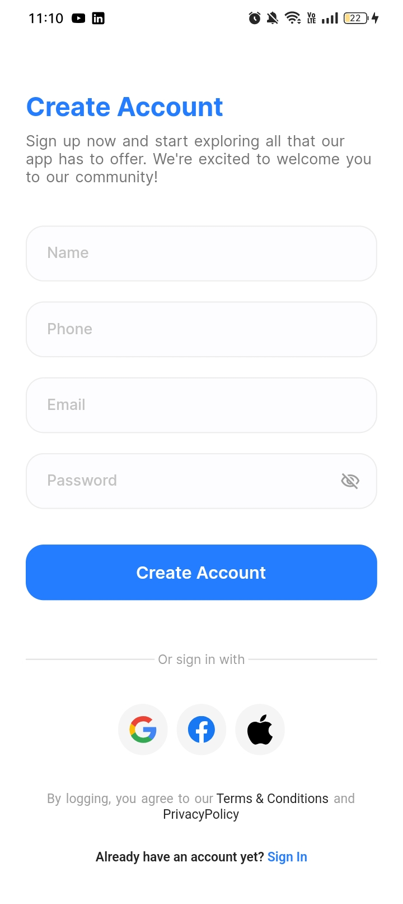
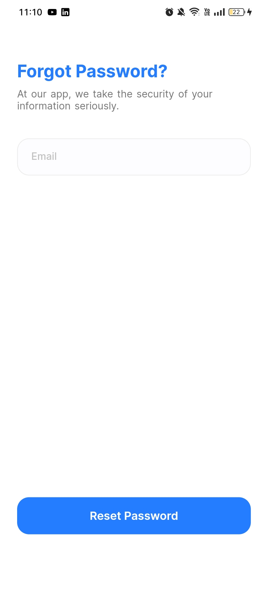

# Docdoc Application 👩‍⚕️🩺
- Doctor Appointment App to manage and schedule all of medical appointments easily.
  
## Note
This repository is still under development

## 🎨 Application Architecture

## 🔌 Packages
- flutter_screenutil
- flutter_svg
- flutter_localizations
- flutter_native_splash
- equatable
- flutter_bloc
- get_it
- internet_connection_checker
- shared_preferences
- dio
- dartz
- mockito
- build_runner
  

## 📸 ScreenShots
| Docdoc                                      | Application                                |
| -----------------------------------------   | -------------------------------------------|
|   |   |
|    |   |
|    |   |

